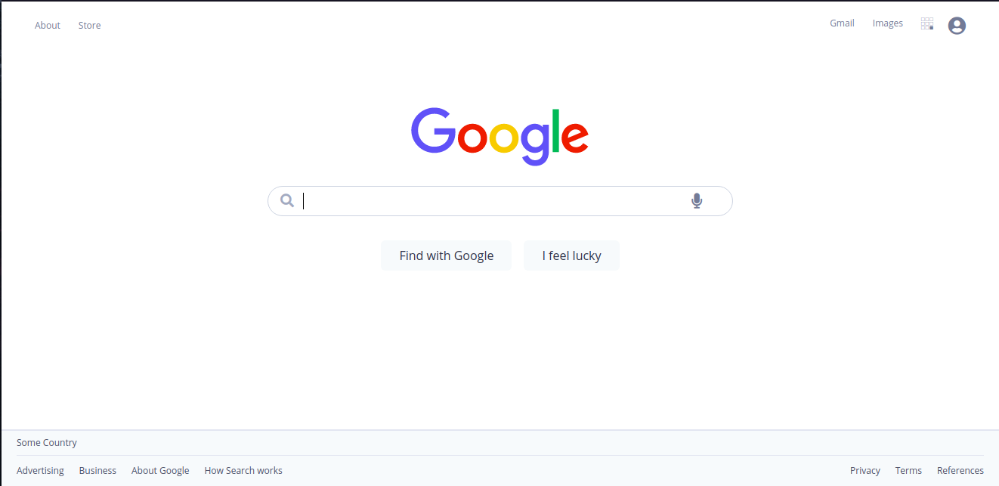

# Google Homepage🌟

## `About this Project`🌟

This project was made with React with TypeScript and TailwindCss with some custom stuff but following the same model

This project was done following the Mobile First giving small details in each one, although there is still editing on different screens

`Screens followed`

- 375px✨

- 1024px✨

## Scripts🌟

In the project directory, you can run:

### `npm isntall`

To install all the necessary dependencies to run this project

### `npm start`

Runs the app in the development mode. 
Open [http://localhost:3000](http://localhost:3000) to view it in the browser.

The page will reload if you make edits. 
You will also see any lint errors in the console.

### `npm run build`

Builds the app for production to the `build` folder. 
It correctly bundles React in production mode and optimizes the build for the best performance.
